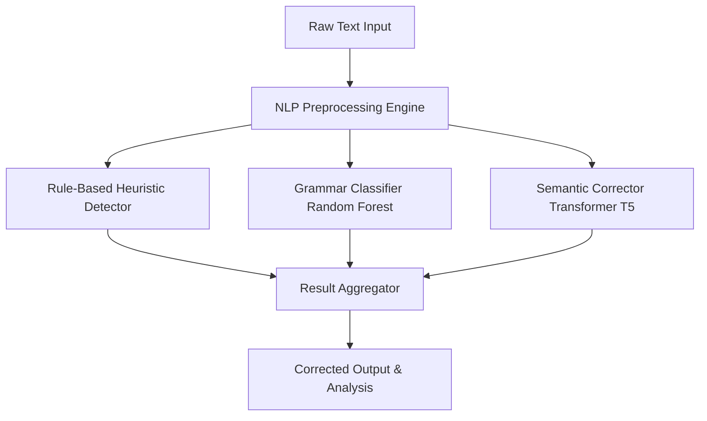

# Automated Identification and Correction of Semantic and Grammatical Errors

An end-to-end, production-ready AI proofreading system combining **lexical rules**, **classical Machine Learning feature-based classification**, and **Deep Learning Transformer sequence-to-sequence generation** to identify, categorize, and correct grammatical syntax and semantic errors in written text.

This project features a modular architecture designed for seamless adaptation to multilingual settings (e.g., mBERT, mT5) and includes a highly interactive two-page Streamlit Dashboard featuring live visualizations, performance metrics, and detailed token-level analytics.

---

## 🔍 System Architecture Overview

The pipeline employs a **Dual-Model Cascade Architecture** to process raw text. By separating rule validation, statistical classification, and contextual correction, it minimizes overhead and ensures high explainability.



### 🧱 Component Breakdown

1. **NLP Preprocessing Engine (`preprocessing.py`)**: 
   - Uses `NLTK` to clean and tokenize input text.
   - Computes morphological features (WordNet lemmatization) and tags syntactic categories (Penn-Treebank Part-of-Speech tagging).
   - Extracts a 14-dimensional syntax/lexical density feature vector for downstream classical ML models.
   - Evaluates fast regular expression patterns for trivial syntactic violations (e.g., repeated words, doubled whitespace, simple article mismatches like *a elephant*).

2. **Grammatical Error Classifier (`models.py`)**:
   - A classical Machine Learning pipeline (Random Forest or Support Vector Machine) trained on lexical and structural features.
   - Multi-class classifier labeling the input into categories: `NO_ERROR`, `VERB_AGREEMENT`, `TENSE_ERROR`, `ARTICLE_ERROR`, `WORD_ORDER`, `PUNCTUATION`, `REPEATED_WORD`, or `SPELLING_OOV`.
   - Offers real-time confidence scores per prediction.

3. **Semantic Corrector Pipeline (`models.py` / Hugging Face)**:
   - Utilizes a sequence-to-sequence transformer model (fine-tuned `T5-base` by default) to rephrase and correct grammatical, syntactic, and contextual semantic errors.
   - Uses beam search (4 beams by default) to suggest the top 3 candidate corrections.

4. **Streamlit Interactive UI Dashboard (`app.py`)**:
   - **Page 1: Real-Time Proofreader** – Side-by-side comparison panels highlighting corrected word diffs, error category probabilities, rule-based alerts, and deep token/POS tag table outputs.
   - **Page 2: Architecture & Metrics** – Live interactive system graph, component specifications, Random Forest classifier performance figures (Precision, Recall, F1 curves via Plotly), feature importance graphs, and the roadmap to swap configuration for other languages.

---

## 🚀 Getting Started

### Prerequisites
- Python 3.9 to 3.11
- PyTorch (CPU or CUDA enabled)

### 1. Clone & Navigate
```bash
git clone <repository_url>
cd RIO-210
```

### 2. Set Up a Virtual Environment
```powershell
# Windows PowerShell
python -m venv venv
.\venv\Scripts\Activate.ps1
```

### 3. Install Dependencies
```bash
pip install -r requirements.txt
```

### 4. Run the Streamlit Dashboard
```bash
streamlit run app.py
```
On its first run, the system will automatically:
1. Download required `NLTK` resources (`punkt`, `wordnet`, etc.).
2. Generate a synthetic training dataset, train the classical ML classifier, and save the binary artifacts in `artifacts/`.
3. Fetch the transformer model (`vennify/t5-base-grammar-correction`) from Hugging Face (this may take a few minutes depending on connection speeds).

---

## 💡 Model Correction Examples

Below is a demonstration of how the dual-model system detects and rectifies errors:

| Input Text | ML Verdict / Probability | Heuristic Rule Flagged | Top Suggested Correction |
| :--- | :--- | :--- | :--- |
| `She don't knows how to plays the guitar since yesterday.` | **VERB_AGREEMENT** (92%) | Subject-Verb Disagreement | `"She hasn't known how to play the guitar since yesterday."` |
| `The the cat sat on the mat.` | **REPEATED_WORD** (99%) | Repeated Word (`The`) | `"The cat sat on the mat."` |
| `He runned fastly to catched the buss before it leave.` | **TENSE_ERROR** (88%) | None | `"He ran fast to catch the bus before it left."` |
| `I saw a elephant at the zoo.` | **ARTICLE_ERROR** (94%) | Article Error (*a* before vowel) | `"I saw an elephant at the zoo."` |
| `Their going to there house over they're for the holidays.` | **PUNCTUATION** (75%) | Possible Homophone Confusion | `"They're going to their house over there for the holidays."` |

---

## 🌍 Multilingual Swapping

The codebase is built on decoupled, configuration-first design principles. To swap the system for a multilingual model:

1. Open `config.py` in your editor.
2. Edit the fields in `TransformerConfig`:

```python
# config.py
@dataclass
class TransformerConfig:
    # Example: swapping English T5 for Google's multilingual T5 (mT5)
    model_name: str = "google/mt5-base"
    task_prefix: str = "correct: "  # Or standard task prefix for target model
    language: str = "multilingual"  # ISO code
```

3. Re-run `app.py`. The `SemanticCorrector` will resolve, cache, and apply the new model structure instantly.
